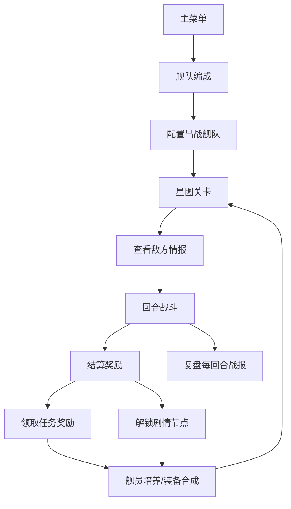

## 1. 产品概述
回合制星舰战术移动游戏《星陨战术》，面向喜欢轻策略的玩家单人闯关。玩家指挥星舰舰队在浩瀚宇宙中探索星图，通过回合制战术战斗击败敌人，培养舰员、收集装备、完成任务、解锁剧情。

- 核心玩法：回合制战术移动+攻击，行动点系统，舰员技能，环境事件
- 目标用户：太空题材爱好者、轻策略游戏玩家
- 产品价值：提供沉浸式太空战术体验，丰富的养成系统和剧情探索

## 2. 核心特性

### 2.1 用户角色
| 角色 | 注册方式 | 核心权限 |
|------|----------|----------|
| 指挥官 | 本地存档 | 指挥舰队、培养舰员、闯关探索 |

### 2.2 功能模块
1. **舰队编成**：舰船站位布置、武器配置、护盾配置
2. **星图关卡**：关卡选择、敌方情报、难度设置
3. **回合战斗**：行动点移动、锁定攻击、技能释放、环境事件、维修舱段、战报复盘
4. **舰员培养**：舰员招募、天赋升级、属性提升
5. **装备仓库**：装备合成、装备管理、材料存储
6. **任务日志**：主线任务、支线任务、任务奖励领取
7. **结算奖励**：战斗结算、星币材料获取、剧情节点解锁

### 2.3 页面详情
| 页面名称 | 模块名称 | 功能描述 |
|-----------|-------------|---------------------|
| 主菜单 | 主界面 | 游戏标题、开始游戏、继续游戏、设置按钮 |
| 舰队编成 | 舰船列表 | 展示所有舰船、选择出战、配置站位 |
| 舰队编成 | 装备配置 | 拖拽配置武器和护盾模块 |
| 星图关卡 | 星图导航 | 可视化星图、关卡节点、难度标识 |
| 星图关卡 | 敌方情报 | 展示敌方舰队配置、预警信息 |
| 回合战斗 | 战场网格 | 六边形/方格战场、舰船移动范围显示 |
| 回合战斗 | 操作面板 | 行动点显示、攻击锁定、技能释放、维修按钮 |
| 回合战斗 | 战报面板 | 每回合战斗日志、伤害数值、事件触发记录 |
| 回合战斗 | 环境效果 | 陨石带、星云、辐射区等特殊地形 |
| 舰员培养 | 舰员名册 | 舰员卡片、属性面板、经验进度 |
| 舰员培养 | 天赋树 | 天赋节点、升级消耗、技能解锁 |
| 舰员培养 | 招募中心 | 随机舰员池、招募消耗、刷新按钮 |
| 装备仓库 | 物品栏 | 装备分类筛选、品质标识、数量统计 |
| 装备仓库 | 合成工坊 | 合成配方、材料消耗、预览产出 |
| 任务日志 | 任务列表 | 主线支线标签、任务进度、奖励展示 |
| 任务日志 | 剧情回放 | 已解锁剧情节点、剧情文本回放 |
| 结算奖励 | 胜利结算 | 经验获取、星币掉落、材料列表、评价星级 |
| 结算奖励 | 存档系统 | 保存战斗进度、自动存档提示 |

## 3. 核心流程

玩家从主菜单开始，先在舰队编成中配置出战舰队，然后在星图选择关卡，查看敌方情报后进入回合战斗。战斗中消耗行动点移动和攻击，可释放舰员技能、应对环境事件、维修受损舱段。胜利后获得星币、材料和经验，结算后可领取任务奖励、解锁剧情节点。之后返回舰队编成强化舰队，或前往舰员培养升级舰员，或在装备仓库合成新装备，循环推进游戏进度。

## 4. 界面设计

### 4.1 设计风格
- **主色调**：深空蓝(#0A1628) + 星舰银(#8B9DC3) + 能量青(#00D4FF)
- **辅助色**：警告橙(#FF6B35)、生命绿(#39FF14)、危险红(#FF2E63)
- **按钮风格**：科技感边框、渐变填充、悬浮发光效果、圆角6px
- **字体**：标题使用Orbitron(科幻等宽风)，正文使用Exo 2(未来感无衬线)
- **布局风格**：深色主题+半透明玻璃拟态卡片+HUD风格信息面板
- **图标风格**：线性轮廓+发光描边，Lucide图标集配合科幻滤镜

### 4.2 页面设计概览
| 页面名称 | 模块名称 | UI元素 |
|-----------|-------------|-------------|
| 主菜单 | 主界面 | 星空背景粒子动画、发光LOGO、霓虹边框按钮、舰船3D预览模型 |
| 舰队编成 | 舰船列表 | 卡片式舰船、拖拽排列站位槽、属性条、品质边框色 |
| 星图关卡 | 星图导航 | SVG连线星图、节点脉冲动画、关卡徽章、进度百分比 |
| 回合战斗 | 战场网格 | 六边形网格、移动范围高亮、攻击范围预览、弹道特效 |
| 回合战斗 | 操作面板 | HUD仪表盘、行动点能量条、技能图标冷却、锁定准星动画 |
| 舰员培养 | 天赋树 | 节点连线、点亮动画、消耗提示、路径高亮 |
| 装备仓库 | 合成工坊 | 熔炉动画、材料槽位、概率显示、品质光效 |
| 结算奖励 | 胜利结算 | 星级评价旋转、数字滚动动画、掉落物飞散、进度条填充 |

### 4.3 响应式
- 桌面优先设计，主战场区域16:9宽屏优化
- 侧边栏支持折叠，小屏幕切换为底部Tab栏
- 触控设备支持手势缩放星图、拖拽舰船

### 4.4 视觉特效指引
- **星空环境**：多层视差星空、远处星云辉光、漂浮陨石粒子
- **战斗特效**：激光弹道、能量护盾波纹、爆炸冲击波、伤害飘字
- **界面动效**：页面切换滑入、卡片悬浮上浮、按钮点击涟漪、数据更新数字滚动
- **音效提示**：武器充能、护盾破裂、警报、舰员语音（可配置开关）
