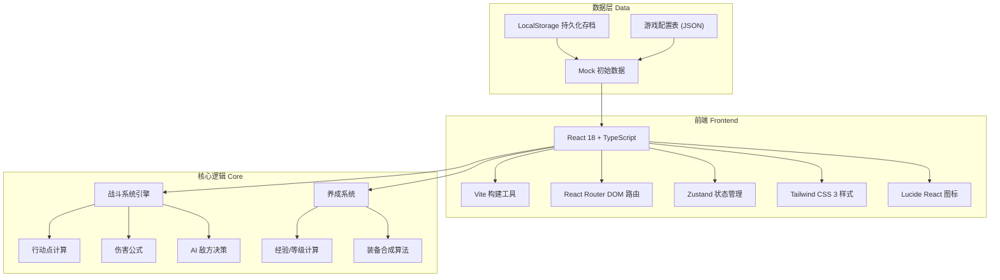
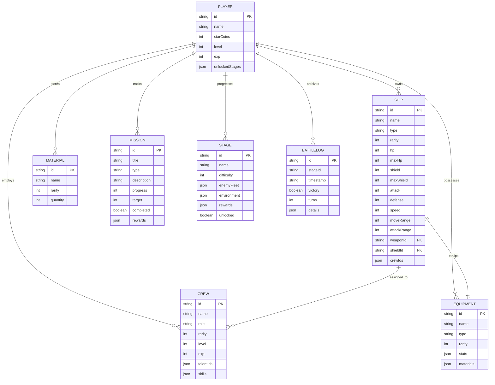

## 1. 架构设计



## 2. 技术说明
- 前端框架: React 18 + TypeScript 5 + Vite 5
- 初始化工具: vite-init react-ts 模板
- 样式方案: Tailwind CSS 3 + CSS 变量主题系统
- 状态管理: Zustand (轻量、简洁、支持持久化中间件)
- 路由管理: React Router DOM 6
- 图标库: Lucide React
- 数据持久化: LocalStorage (zustand/middleware persist)
- 后端: 无后端，纯前端游戏，数据全存储于本地

## 3. 路由定义
| 路由 | 用途 |
|-------|---------|
| / | 主菜单 (MainMenu) |
| /fleet | 舰队编成 (FleetFormation) |
| /starmap | 星图关卡 (StarMap) |
| /battle/:levelId | 回合战斗 (Battle) |
| /crew | 舰员培养 (CrewTraining) |
| /warehouse | 装备仓库 (Warehouse) |
| /missions | 任务日志 (Missions) |
| /result/:battleId | 结算奖励 (BattleResult) |

## 4. 数据模型

### 4.1 数据模型定义 (ER图)



### 4.2 核心数据类型 (TypeScript)

```typescript
// 舰船类型
interface Ship {
  id: string;
  name: string;
  type: 'battleship' | 'cruiser' | 'destroyer' | 'carrier' | 'support';
  rarity: 1 | 2 | 3 | 4 | 5;
  hp: number;
  maxHp: number;
  shield: number;
  maxShield: number;
  attack: number;
  defense: number;
  speed: number;
  moveRange: number;
  attackRange: number;
  actionPoints: number;
  maxActionPoints: number;
  weapon?: Equipment;
  shieldModule?: Equipment;
  crewIds: string[];
  position?: { x: number; y: number };
  statusEffects: StatusEffect[];
}

// 舰员类型
interface Crew {
  id: string;
  name: string;
  role: 'captain' | 'gunner' | 'engineer' | 'pilot' | 'medic';
  rarity: 1 | 2 | 3 | 4 | 5;
  level: number;
  exp: number;
  maxExp: number;
  talents: Talent[];
  skills: Skill[];
  stats: { leadership: number; gunnery: number; engineering: number; piloting: number; medical: number };
}

// 装备类型
interface Equipment {
  id: string;
  name: string;
  type: 'weapon' | 'shield' | 'module';
  rarity: 1 | 2 | 3 | 4 | 5;
  level: number;
  stats: Record<string, number>;
  description: string;
}

// 战斗状态
interface BattleState {
  id: string;
  stageId: string;
  turn: number;
  phase: 'player' | 'enemy' | 'environment';
  playerFleet: Ship[];
  enemyFleet: Ship[];
  gridSize: { width: number; height: number };
  environmentTiles: EnvironmentTile[];
  battleLog: LogEntry[];
  selectedShipId: string | null;
  targetedShipId: string | null;
  validMoves: { x: number; y: number }[];
  validTargets: string[];
}

// 任务类型
interface Mission {
  id: string;
  title: string;
  type: 'main' | 'side' | 'daily';
  description: string;
  progress: number;
  target: number;
  completed: boolean;
  claimed: boolean;
  rewards: { starCoins?: number; materials?: { id: string; quantity: number }[]; exp?: number };
  storyUnlock?: string;
}

// 剧情节点
interface StoryNode {
  id: string;
  title: string;
  unlocked: boolean;
  content: string[];
  choices?: { text: string; nextNode?: string }[];
}
```

## 5. 项目结构

```
src/
├── components/           # 通用组件
│   ├── ui/              # 基础UI组件 (Button, Card, Modal, ProgressBar等)
│   ├── ShipCard.tsx     # 舰船卡片
│   ├── CrewCard.tsx     # 舰员卡片
│   ├── EquipmentCard.tsx # 装备卡片
│   ├── StarField.tsx    # 星空背景
│   └── HUD/             # HUD组件集
├── pages/               # 页面组件
│   ├── MainMenu.tsx
│   ├── FleetFormation.tsx
│   ├── StarMap.tsx
│   ├── Battle.tsx
│   ├── CrewTraining.tsx
│   ├── Warehouse.tsx
│   ├── Missions.tsx
│   └── BattleResult.tsx
├── store/               # Zustand状态管理
│   ├── useGameStore.ts  # 游戏全局状态
│   ├── useBattleStore.ts # 战斗状态
│   └── useUIGlobalStore.ts # UI全局状态
├── data/                # 配置数据
│   ├── ships.ts         # 舰船配置表
│   ├── crews.ts         # 舰员配置表
│   ├── equipment.ts     # 装备配置表
│   ├── stages.ts        # 关卡配置表
│   ├── missions.ts      # 任务配置表
│   └── stories.ts       # 剧情配置表
├── hooks/               # 自定义hooks
│   ├── useBattleLogic.ts # 战斗逻辑
│   ├── useAnimation.ts   # 动画钩子
│   └── usePersistence.ts # 存档钩子
├── utils/               # 工具函数
│   ├── battleCalculations.ts # 战斗计算公式
│   ├── gridUtils.ts     # 网格坐标工具
│   ├── rarityColors.ts  # 品质配色
│   └── randomUtils.ts   # 随机数工具
├── types/               # TypeScript类型定义
│   └── index.ts
├── App.tsx
├── main.tsx
└── index.css
```
